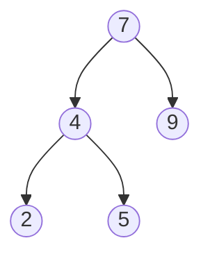

连一刻也没有为图的听不懂哀悼，立刻赶来战场的是——查找！

---

从本章开始基本的数据结构已经差不多学习完毕，开始涉及一些基础的算法知识。（其实先前已经接触了一些经典的算法了，说的就是你呢迪杰斯特拉）。查找是最为基础的算法之一，所涉及的知识点也较为简单。

## 序言

那么我们这篇文章主要会学习以下几个知识点：

- 顺序查找

  没啥好说的，就是遍历元素直到找到为止。

- 折半查找

  应该是借鉴了分治法的思想，能够以较好的时间复杂度查找元素，和快排类似。但是只限用于**顺序储存结构**的**有序表**。

- 分块查找

  也没啥好说的，是一种对顺序查找的改进算法。除了查询表本身外还需要建立一个索引表，将要查找的内容分块提前筛掉一部分数据缩小搜索范围，提高效率。

以上三点都属于**静态查找**，接下来是**动态查找**。

- 二叉排序树/BST

  重点之一，相对不是很难理解。

- 平衡二叉树/AVL

  重点之二，有点烧脑，本篇的重心。

- B+、B-等变体树

  仅作为拓展内容了解即可。

至于什么是静态查找什么是动态查找呢？静态就是说只进行查找操作，而不涉及插入或删除数据的操作；动态则不仅查找过程，还会设计插入或删除数据元素的操作。

那么闲话少说，真是开始进入正文部分。

## 静态查找

这里我们来简单地过一遍静态查找。

### 顺序查找

为了结构还是给它点面子吧，最简单最无聊的查找算法，没有之一。手搓一个for或者while循环即可满足操作（如果你甚至不知道怎么搓循环，我很好奇你是怎么看到这的）

不过为了排版起见我还是简单地丢一段示例代码在这里。

```c
#include <stdio.h>
#include <stdlib.h>
#include <time.h>

int main() {
    int a[10],b[10],c;
    _Bool bool;
    srand((unsigned ) time(NULL));
    printf("创建一个大小为10的无序数组……\n");
    for (int i = 0; i < 10; ++i) {
        a[i]=rand()%10;
    }
    // printf("%d",rand()%10)
    printf("创建成功，数组为：");
    for (int i = 0; i < 10; ++i) {
        printf("%d ",a[i]);
    }
    c=rand()%10;
    printf("\n查找元素c：%d\n",c);
    for (int i = 0; i < 10; ++i) {
        printf("%d==%d？\n",a[i],c);
        bool=a[i]==c;
        // printf("%d\n",bool);
        if(bool){
            printf("找到了\n");
            return 0;
        } else printf("false\n");
    }
    printf("没找到\n");
    return 0;
}

```

与其他查找算法相比，顺序查找：

- 优点：算法简单，适应面广。对表的结构无任何要求，无论记录是否按关键字有效都适用。
- 缺点：平均查找长度大，特别是当N很大时，查找效率低下。

### 拆分查找

其实我更喜欢叫它“快速查找”，因为它的思想和快速排序很像。了解过快排的都知道什么意思，不过我在这里还是简要的提一嘴。

首先折半查找只适用于一个**顺序储存结构**的**有序表**。在这个基础上，我们才能够确定查找表（为了简单起见我假设他是一个有序数组a[N]）初始的最大项和最小项，将它们的下标记为max=N和min=0。由max和min我们可以计算出中间值的下标，我们记为mid=(min+max)/2。之后要做的就是将要查找的值与中间值a[mid]进行比较来逐步缩小查找范围，每次都只在大于或小于中间值的一半进行搜索。由于拆分查找这样做每次比较能丢弃掉一半的数据，所以是十分高效的。

这里我也简单的放出它的代码实现。

```c
#include <stdio.h>
#include <stdlib.h>
#include <time.h>

void QuickFind(int* FindArray,int Target,int length){
    int min,max,mid;
    min=0;
    max=length-1;

    printf("\n使用折半查找来查找元素%d\n",Target);
    while (min<=max){
        mid=(int)((min+max)/2);
        printf("min=%d max=%d mid=%d\n",FindArray[min],FindArray[max],FindArray[mid]);
        printf("%d==%d?\n", Target, FindArray[mid]);
        if (FindArray[mid] == Target){
            printf("True\n找到了\n\n");
            return ;
        } else if (FindArray[mid] < Target){
            printf("False\n小了\n");
            min=mid+1;
        } else{
            printf("False\n大了\n");
            max=mid-1;
        }
        // if (max==min) {
        //     printf("没找到\n\n");
        //     return ;
        // }
    }
        printf("没找到\n\n");
}

int main() {
    int a[10],c,d;
    int min,max,mid,length;

    srand((unsigned ) time(NULL));
    printf("生成一个有序数列\n");
    for (int i = 0; i < 10; ++i) {
        a[i]=rand()%50;
    }
    for (int i = 0; i < 10; ++i) {
        for (int j = 1; j < 10; ++j) {
            int temp;
            if (a[j]<a[j-1]){
                temp=a[j];
                a[j]=a[j-1];
                a[j-1]=temp;
            }
        }
    }
    printf("生成成功，数列为：");
    for (int i = 0; i < 10; ++i) {
        printf("%d ",a[i]);
    }

    c=rand()%50;
    d=a[rand()%10];
    length=sizeof (a)/sizeof (int);
    // printf("使用折半查找来查找元素c：%d\n",c);
    QuickFind(a,c,length);
    QuickFind(a,d,length);

    return 0;
}

```

由于拆分查找的特性，我们可以用一棵二叉树来表述，树中的每个节点代表一个记录，节点中的值为该记录在表中的位置，通常我们称这个描述查找过程的二叉树为**判定树**。

### 分块查找

分块查找其实更多的是一种改进算法的思想，而不是一种全新的查找算法。

首先对每个子表（或称块）建立一个索引项。索引项包括两项内容：关键字项（其值可以是表中的最大关键字）和指针项（记录该子表的第一个记录在表中的位置）。要求在分块后，数据整体按块有序，但是块的内部任仍然是无序的。

这样分块后，我们在查找元素时，可以首先按关键字查找分块的索引值快速定位查找元素的大致范围。至于如何查找索引表，可以顺序查找块，也可以二分/拆分查找块。但是在对应的数据块中仍然是无序的，我们就只能按照顺序查找块中的元素。

由于分块查找需要先查找索引表后再查找相应的数据块，所以至少要进行**两次**关键词比较。

由于查找表的数据类型不定，这里就暂且不给出建立索引表的代码了。

## 动态查找

终于进入到本篇文章的重头戏了，重点是二叉搜索树和二叉平衡树。其中二叉搜索树是二叉平衡树的基础。这里又涉及到树的知识了，理论上说这节内容也可以归档于树的问题集。

### 二叉搜索树

二叉搜索树的主要用途是为了做*搜索*。一般的二叉树进行搜索的最坏情况时间复杂度为O(n)，而二叉搜索树则能在最坏情况下将时间复杂度降至O(logn)。

#### 性质

在二叉搜索树中，左子树中所有节点的值应该小于根节点的值，右子树种所有节点的值应该大于根节点的值，这就意味着：

- 一个节点的左子树只能包含比该节点小的节点。
- 一个节点的右子树只能包含比该节点大的节点。
- 其左右子树也必须是二叉搜索树。

举个例子，下图就是一棵二叉搜索树。



二叉搜索树的声明与常规二叉树的声明之间没有不同，他们之间的差别仅仅体现在节点的值上而不是结构上。但是为了方便我们重新修改了节点的名字。

```c
struct BinarySearchTreeNode{
    int data;
    struct BinarySearchTreeNode*left;
    struct BinarySearchTreeNode*right;
};
```

#### 注意

- 因为二叉树特殊的性质以及根节点总是位于左子树和右子树之间，所以对二叉搜索树做中序遍历，能够得到一个有序序列。
- 在二叉搜索树中，我们要么只考虑左子树要么只考虑右子树，而不用同时考虑左右两个子树，因此相较于常规二叉树效率大大提高了。

#### 操作

二叉搜索树的主要操作如下：

- 在二叉搜索树中查找元素/查找最大元素/查找最小元素
- 插入元素到搜索二叉树中
- 从二叉树搜索树中删除元素

辅助操作如下：

- 在二叉搜索树中查找第k小的元素
- 对二叉搜索树的节点进行排序

##### 查找元素

在BST中查找元素是很简单的，我们从根节点开始，依次将查找值与根节点进行比较。如果查找值大于根节点，那么就进入根节点的右子树；如果查找值小于根节点，那么就进入根节点的左子树；如果查找值等于根节点，那么查找结束；如果直到根节点的左子树或者右子树为NULL都未找到查找元素，说明代查元素不存在，我们返回NULL指针即可。

下面是具体的代码实现。

```c
struct BinarySearchTreeNode*Find(struct BinarySearchTreeNode*root,int data){//递归写法
    if(root==NULL){
        return NULL;
    }
    if(data<root->data)
        return Find(root->left,data);
    else if(data>root->data)
        return Find(root->right,data);
    return root;
}

struct BinarySearchTreeNode* Find(struct BinarySearchTreeNode*root,int data){//非递归写法
    if(root==NULL)
        return NULL;
    while (root){
    if(data==root->data)
        return root;
    else if(data>root->data)
        root=root->right;
    else root=root->left;
    }
    return NULL;
}

```

最坏情况下的时间复杂度为O(n)（当BST为一棵偏斜树时），这为我们之后介绍平衡二叉搜索树埋下了伏笔。

##### 查找最小元素

在BST中，最小元素是最左下节点，该节点没有左孩子。

代码实现如下。

```c
struct BinarySearchTreeNode*FindMin(struct BinarySearchTreeNode*root){//递归写法
    if(root==NULL)
        return NULL;
    else if(root->left==NULL)
        return root;
    else
        return FindMin(root->left);
}

struct BinarySearchTreeNode*FindMin(struct BinarySearchTreeNode*root){//非递归写法
    if(root==NULL)
        return NULL;
    while (root->left!=NULL)
        root=root->left;
    return root;
}
```

##### 查找最大元素

和查找最小元素的思路相同，原理不再赘述。

下面是具体的代码实现。

```c
struct BinarySearchTreeNode* FindMax(struct BinarySearchTreeNode*root){//递归写法
    if(root==NULL)
        return NULL;
    else if(root->right==NULL)
        return root;
    else
        return FindMin(root->right);
}

struct BinarySearchTreeNode*FindMax(struct BinarySearchTreeNode*root){//非递归写法
    if(root==NULL)
        return NULL;
    while (root->right!=NULL)
        root=root->right;
    return root;
}
```

---

（待更新……）


